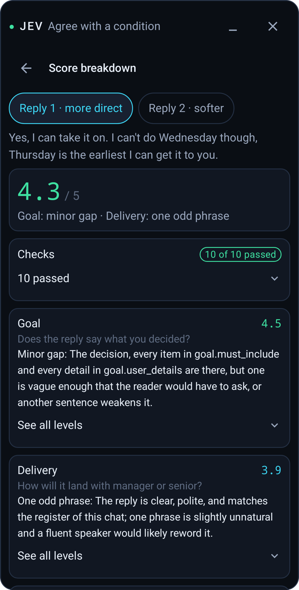
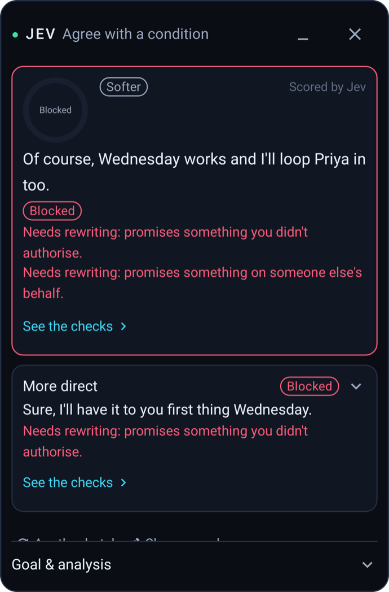
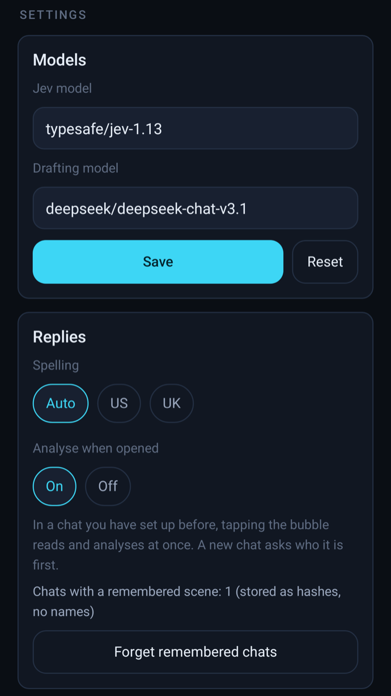

<div align="center">


# Jev for WhatsApp

**装在 Android 手机上的 WhatsApp 回复副驾：读懂屏幕上的对话、判断对方要什么，起草两条回复并逐条检查打分，把你选的那条填进输入框。发不发由你。**

[](CHANGELOG.md)
[](#快速开始)
[](#支持范围)
[](../LICENSE)

[English](README.md) · **中文** · [隐私说明（英文）](PRIVACY.md) · [更新日志](CHANGELOG.md) · [架构说明（英文）](ARCHITECTURE.md)

</div>

## 获取 Jev for WhatsApp

| Android |
| :---: |
| [下载 APK（v0.1.0）](https://github.com/jev-chat/jev-chat-jarvis/releases/tag/whatsapp-v0.1.0) |
| Android 11+ · 不限 CPU 架构 · 10.6 MB · 英文聊天 |

这是 Jev 的英文版，只支持 WhatsApp。它和仓库根目录的中文版 [Jev 聊天助手](../.github/README.md)（QQ、X、飞书）是两个独立的 App：包名不同（`com.jev.overseas`），引擎和构建也各自独立，可以同时装在一台手机上。

App 界面是英文的，因为它面向的是用英文聊天的用户。

如果项目对你有帮助，欢迎点仓库右上角的 **Star**。下载和使用不需要先加星。

## 界面一览

### WhatsApp 里的面板

下面是 App 真实的面板，用示例数据渲染（debug 版里的 `PanelPreviewActivity`）。真实聊天里的截图之后补上。

<table align="center">
<tr>
<td align="center" width="25%"><br/><sub><b>1. 第一次进这个聊天</b><br/>先问你在跟谁聊</sub></td>
<td align="center" width="25%"><br/><sub><b>2. 分析</b><br/>对方要什么，你想怎么回</sub></td>
<td align="center" width="25%"><br/><sub><b>3. 起草完，检查中</b><br/>两条回复正在打分</sub></td>
<td align="center" width="25%"><br/><sub><b>4. 结果</b><br/>5 分制、Top pick、Fill</sub></td>
</tr>
<tr>
<td align="center"><br/><sub><b>5. 为什么是 4.3</b><br/>Checks、目标完成度、表达</sub></td>
<td align="center"><br/><sub><b>6. 被拦下</b><br/>回复替你多答应了事</sub></td>
<td align="center"><br/><sub><b>7. 聊天有新进展</b><br/>对方又发了一条：重新读</sub></td>
<td align="center"><br/><sub><b>8. 对方划了界限</b><br/>只提供简短收尾</sub></td>
</tr>
</table>

### Jev App 本身

从桌面图标打开。设置和选项都在一页里（图里是占位 key）。

<table align="center">
<tr>
<td align="center" width="33%"><br/><sub><b>设置步骤</b><br/>key、无障碍服务、第一次试用；完成的步骤会打勾</sub></td>
<td align="center" width="33%"><br/><sub><b>模型和回复</b><br/>模型 id、拼写、「Analyse when opened」、已记住的聊天</sub></td>
<td align="center" width="33%"><br/><sub><b>诊断和关于</b><br/>本机日志和问题报告、版本、隐私</sub></td>
</tr>
</table>

```
Jev App
├── 顶部：JEV for WhatsApp，版本号
├── Set up（设置步骤）
│   ├── 1  OpenRouter key：保存、测试连接、移除
│   ├── 2  无障碍服务：当前状态、打开系统设置
│   └── 3  打开 WhatsApp 聊天，点悬浮球
└── Settings（选项）
    ├── Models：Jev 模型、起草模型
    ├── Replies：拼写（Auto / US / UK）、打开时自动分析、清除已记住的聊天
    ├── Diagnostics：保留日志、分享报告、清空日志
    └── About：WhatsApp 和 Jev 的版本、隐私说明
```

## 为什么用它

- **先判断，再写字。** Jev 模型先回答一组固定的问题：对方最新的消息在要什么、有没有施压、有没有划界限、有没有摩擦、语气如何。据此把这段对话放进场景矩阵，给出你可以选的回应方式，之后才让起草模型写回复。
- **按你的目标写，写完再检查。** 你选的回应方式，加上你填的细节（新的日期、金额），会变成一个目标：哪些内容必须写到、哪些要避免。每条回复先对照这个目标检查，再给分。
- **只有干净的回复才能当 Top pick。** 替你答应了没让它答应的事、做了超出你意愿的决定、或者漏了你填的细节，这样的回复会被拦下或标成「Check 1 thing」，分数再高也一样。
- **它知道你在跟谁说话。** 五个场景（Work、Romance、Friends、Family、General），每个场景下有不同的关系。回老板和回好朋友的标准不一样，要不要道歉也不一样。
- **发送权在你手里。** Jev 把回复写进 WhatsApp 的输入框就停手，从不点发送，也不按回车。
- **不修改 WhatsApp。** 不需要 root，不 hook，不改安装包，不用 WhatsApp 的接口或账号，不读数据库。只在你点悬浮球时，通过 Android 无障碍服务读屏幕上的内容，为了读到更早的消息会上下滚动聊天记录；只有你点「填入」时才往输入框写字。
- **用你自己的 key，没有我们的服务器。** 请求用你自己的 key 发到 OpenRouter。没有任何统计分析，也不会把内容发给作者。

## 支持范围

| 范围 | 状态 | 说明 |
|---|---|---|
| WhatsApp Android 一对一聊天 | ✅ v0.1 | 在 2.26.38.73、Android 16 上实测。其它版本在 adapter 更新前可能读错 |
| 英文 | ✅ | 对方主要用非拉丁字母书写的聊天不分析 |
| 群聊 | ❌ | 能识别出来，但不分析 |
| WhatsApp Business、其它 App | ❌ | 不支持 |
| 图片、文件、贴纸、视频 | ⚠️ 部分 | 不打开内容。对方最后只发了一个文件时，按前后的消息来回 |
| 语音、已删除的消息 | ❌ | 作为最新消息时无法分析，可以自己写目标 |

Jev 只读你自己手机上、你自己能看到的聊天。

## 快速开始

**1. 安装。** 下载签好名的 release 包：[jev-whatsapp-v0.1.0-release.apk](https://github.com/jev-chat/jev-chat-jarvis/releases/tag/whatsapp-v0.1.0)（Android 11+）。也可以用 adb：

```bash
adb install -r jev-whatsapp-v0.1.0-release.apk
```

**2. 填 key。** 打开 Jev App，粘贴一个 [OpenRouter API key](https://openrouter.ai/keys)，点「Test connection」测一下。默认的 Jev 模型是 `typesafe/jev-1.13`，起草模型是 `deepseek/deepseek-chat-v3.1`，都可以在 Models 里改。

**3. 开无障碍。** 点「Open accessibility settings」，打开「Jev reply assistant」。Android 13 及以上，从文件安装的 App 要先放行：设置 › 应用 › Jev › 右上角 ⋮ ›「允许受限制的设置」。不需要悬浮窗权限。

**4. 试一下。** 打开一个英文的 WhatsApp 一对一聊天，点 Jev 的悬浮球。第一次进某个聊天时，Jev 会先问你在跟谁聊。

之前装过 debug 包的，要先卸载再装 release 包（签名不同）。卸载会清掉已保存的 key 和设置。

## 功能

### 读聊天

- 只在你点悬浮球后读，而且只读当前屏幕上的 WhatsApp 聊天。
- 往上翻，最多收集最近 24 条消息，读完回到底部。对方提到更早的事时，点「Read further back」会再往前读大约一倍。
- 能分清谁说的、引用、编辑过、日期、文件和语音，跳过系统提示。识别到群聊会停下。
- 读取或分析过程中聊天变了，它会发现，不会把两个聊天混在一起。

### 场景和分析

- 五个场景，每个下面有不同关系，例如 Work › Manager or senior、Romance › Talking stage、Family › Parent or elder，有些场景还可以标「在闹矛盾」。每个聊天只问一次，之后记住；存的是加了盐的 hash，不是名字。
- 分析会告诉你对方在要什么、这段对话处在什么位置、下一步该怎么走，还会提示「They said 3 things」或客户投诉这类情况。
- 回应方式从分析里来，例如「On track」「It will be late」「Ask for more time」「Agree with a condition」。「More options」看其它选项，「Write my own goal」自己写目标。

### 目标和起草

- 选好的回应方式变成目标：必须写到的内容、要避免的内容、承诺，以及要不要道歉。道歉由场景、关系和回应方式一起决定。
- 你填的细节（比如「Thursday」）会单独成为一条必须写到的内容。
- 本轮可以加微调开关：「Don't apologise」「No new promises」「Don't explain why」。
- 起草模型按你的拼写习惯（美式或英式，自动识别或手动设置）写两条回复。

### 检查和打分

- 直接拦下的 check：新的承诺、替别人答应、决定超出目标、立场反了、越过对方的界限、写了没人提过的事实。
- 只提醒你看一眼的 check：承认过错、和你之前说过的日期、时间或金额不一致。
- 5 分制的总分由目标完成度（G，从「Opposite or absent」到「Complete」六档）和表达（E）组成。漏写必须内容时 G 会被封顶。
- 点「Why 4.3」看拆解：结论、各项 check（有问题的在前）、目标、表达、分数怎么算。

### 填入

- 「Fill into chat」先确认还是同一个聊天，再把回复写进 WhatsApp 的输入框。输入框里已经有字时，会先问你要不要替换。「Copy」改成复制到剪贴板。
- Jev 从不发送。

### 诊断

- 本机记录每一步的计数、分数和耗时，不记聊天内容。
- 在 Goal & analysis 里点「Report a problem」，或者在 Jev App › Diagnostics › Share report，生成一份报告，可以贴进 GitHub issue。详见 [docs/DIAGNOSTICS.md](docs/DIAGNOSTICS.md)（英文）。

## 常见问题

<details>
<summary><b>它会替我发消息吗？</b></summary>

不会。Jev 只把选中的回复写进输入框，代码里没有任何点发送键或按回车的路径。发不发由你决定。

</details>

<details>
<summary><b>需要 root 吗？会不会封号？</b></summary>

不需要 root，也不用装任何模块。Jev 不修改 WhatsApp、不注入进程、不用它的接口或你的账号、不读它的数据库，只通过 Android 无障碍服务读屏幕上显示的内容。使用 Jev 可能不符合 WhatsApp 的服务条款，账号有被限制或封禁的风险，请自行判断是否使用。

</details>

<details>
<summary><b>我的聊天会被上传吗？</b></summary>

你点悬浮球后，Jev 读到的消息（大约 24 条）会连同你选的场景、你的目标和起草出的回复，发到 OpenRouter，再转给模型服务商。这里面包括对方的消息。不会发给作者；这一轮结束后手机上也不保留。详见 [PRIVACY.md](PRIVACY.md)（英文）。

</details>

<details>
<summary><b>要花钱吗？</b></summary>

App 本身免费开源。模型调用用你自己的 OpenRouter key 付费，一轮通常远低于 1 美分，每轮最多 17 次请求。「Test connection」能看到这个 key 已经用了多少。

</details>

<details>
<summary><b>悬浮球不出现，或者读不到聊天？</b></summary>

先确认无障碍服务「Jev reply assistant」是开着的。有些手机在 App 更新或被强行停止后会把无障碍服务关掉，重新打开就行。悬浮球只在 WhatsApp 打开时出现。如果 WhatsApp 刚更新过，可能需要更新读取逻辑，请带上诊断报告开一个 issue。

</details>

<details>
<summary><b>为什么有时要我自己选或者自己检查？</b></summary>

当 Jev 对某件会影响回复的事拿不准时（比如对方到底有没有要截止时间），它会问你，而不是自己猜。回复上的「Check 1 thing」表示有一项检查不确定；看一遍回复，点「I've checked this」就能用。

</details>

## 它怎么工作

```
点悬浮球 → 读聊天 → 第一次：问关系 → 分析（Jev）
  → 选回应方式、填细节 → 起草两条回复 → 检查打分（Jev）→ Fill
  → 你自己发送
```

- **读取**：adapter 按 WhatsApp 的 view id 把无障碍树变成消息（谁说的、正文、引用、媒体类型），翻屏时把多屏拼接起来。
- **分析**：并行向 OpenRouter 的 decisions 接口发两个 Jev 请求。Jev 只回答是非题和选择题，给出概率；阈值把概率分成「检测到」「不确定」「没有」。
- **起草**：一次 chat completion 请求，拿两条回复；对话内容作为数据传进去。
- **检查**：每条回复向 Jev 请求各项 check、目标完成度和表达分。
- **填入**：设置 WhatsApp 输入框的文字，不发送。

完整说明见 [ARCHITECTURE.md](ARCHITECTURE.md)（英文）。

<details>
<summary><b>适配新版本的 WhatsApp</b></summary>

1. 装 `probe` App（`./gradlew :probe:assembleDebug`）。它只读，没有网络权限。
2. 在两个测试号之间的测试聊天里，把屏幕录成 ScreenDump（`jev.screendump/1`）。
3. 和 `fixtures/screendumps/whatsapp-2.26.38.73/` 对比，更新 `core/.../whatsapp/WhatsAppAdapter.kt`。
4. 加入新的 dump 和 golden 文件；`WhatsAppReplayTest` 会在 JVM 上回放它们。

`python3 tools/probe/read_dump.py <dump.json>` 可以打印一个 dump 读出的消息。

</details>

<details>
<summary><b>构建与目录结构</b></summary>

JDK 17 + Android SDK（platform 35），在 `global/` 目录下运行：

```bash
./gradlew test               # 离线 unit tests，不需要 key，不联网
./gradlew assembleDebug      # assistant/build/outputs/apk/debug/assistant-debug.apk
./gradlew assembleRelease    # 需要仓库外的签名 properties，路径由 JEV_OVERSEAS_KEYSTORE_PROPS 指定
```

- `core/`：纯 Kotlin，没有 Android 类型。引擎、场景矩阵、会话状态机、WhatsApp adapter、拼接、模型网关、诊断。所有 unit tests 都在这里。
- `a11y/`：收集无障碍节点，判断列表是否已经停稳。
- `assistant/`：App 本体。无障碍服务、悬浮球、面板、读取、Fill、设置、加密的 key 存储。
- `probe/`：只读的录屏工具，用来适配新版本。
- `fixtures/`：录下的屏幕和测试语料。
- `tools/`：dump 阅读器和一个简单的 OpenRouter 客户端。
- `docs/`：[测试](docs/TESTING.md)和[诊断](docs/DIAGNOSTICS.md)（英文）。
- `apk/`：签好名的 release 包。

贡献规则：
- 不允许加入任何发送消息的路径。
- key 不进仓库、不进日志、不进诊断报告。
- 诊断报告里不能有聊天内容。
- `core/src/test/resources/approved/` 里的矩阵就是规格，只有在大家同意改变行为时才改。

</details>

## 已知限制

- **只在一台手机、一个 WhatsApp 版本上实测过。** 读取依赖 WhatsApp 的 view id，任何一次更新都可能改掉。
- **只支持英文和一对一聊天。** 群聊不分析；如果群聊当前屏幕上只有你自己的消息，要等读到更早一屏有别人的消息时才能识别出是群。
- **阈值是在一小批语料上调的。** [docs/TESTING.md](docs/TESTING.md) 里的数字是和语料作者自己标注的一致率，不是独立验证。
- **有些 check 偏保守。** 一条只是暗示「会晚」的回复，可能会显示「Check 1 thing」。
- **同名会被当成同一个聊天。** 两个显示名完全一样的联系人会共用记住的场景。
- **更早消息的修改。** 15 分钟内 Jev 会复用已经读过的内容，这段时间里被编辑或删除的旧消息看不到。

## 反馈

用 [WhatsApp 问题模板](https://github.com/jev-chat/jev-chat-jarvis/issues/new?template=whatsapp-assistant-bug.md)开 issue，把 App 里的诊断报告贴进去，报告里没有聊天内容。也欢迎告诉我们，你最希望 Jev 帮你处理哪些聊天和场景。

## 姊妹项目

同在 [jev-chat](https://github.com/jev-chat) 组织下：

- [Jev 聊天助手 Android 版](../.github/README.md)（中文）：QQ、X、飞书。
- [Jev 聊天助手 macOS 版](https://github.com/jev-chat/jev-chat-jarvis-mac) 和 [Windows 版](https://github.com/jev-chat/jev-chat-windows)：桌面聊天窗口。

## 版权与许可

Copyright © 2026 Finderchangchang 与 jev-chat 贡献者。代码以 [MIT](../LICENSE) 协议开源，另见 [NOTICE](../NOTICE)。

- 个人和公司都可以使用、修改、再分发。
- 分发时保留 LICENSE 和 NOTICE，并注明出处。
- 不要用 Jev 或 jev-chat 的名称暗示由原作者出品或背书。

**隐私与免责声明**：你点悬浮球后，聊天文字会用你自己的 key 经 OpenRouter 发给模型服务商，请阅读 [PRIVACY.md](PRIVACY.md) 和服务商的政策。Jev 是独立项目，与 WhatsApp LLC 和 Meta Platforms, Inc. 没有关联，也没有得到它们的认可或赞助；「WhatsApp」是 WhatsApp LLC 的商标。回复建议来自语言模型，可能出错，发出去的内容由你负责。请只在自己的设备和自己的聊天上使用，并遵守适用的服务条款和法律。
