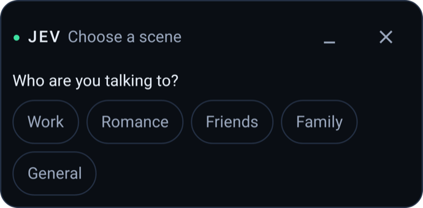
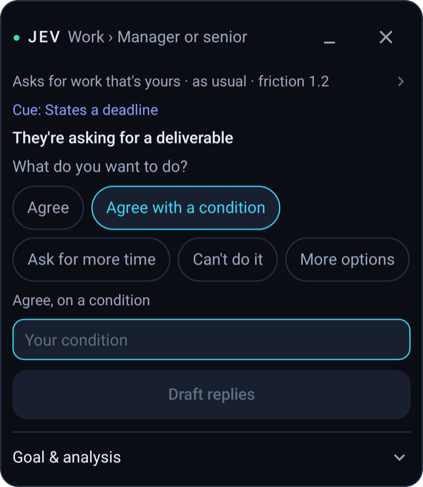
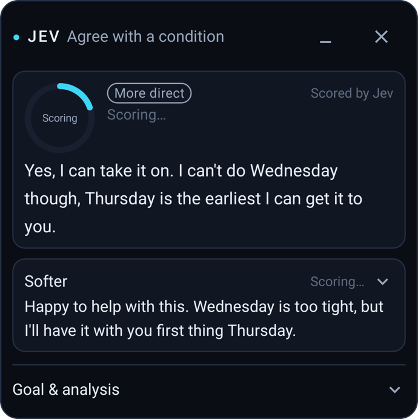
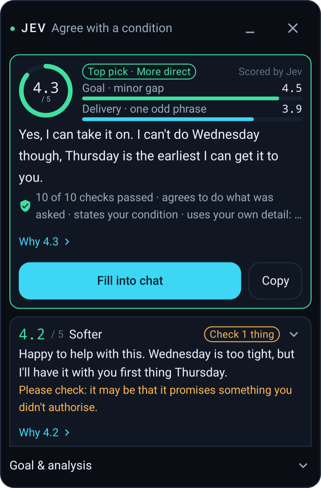
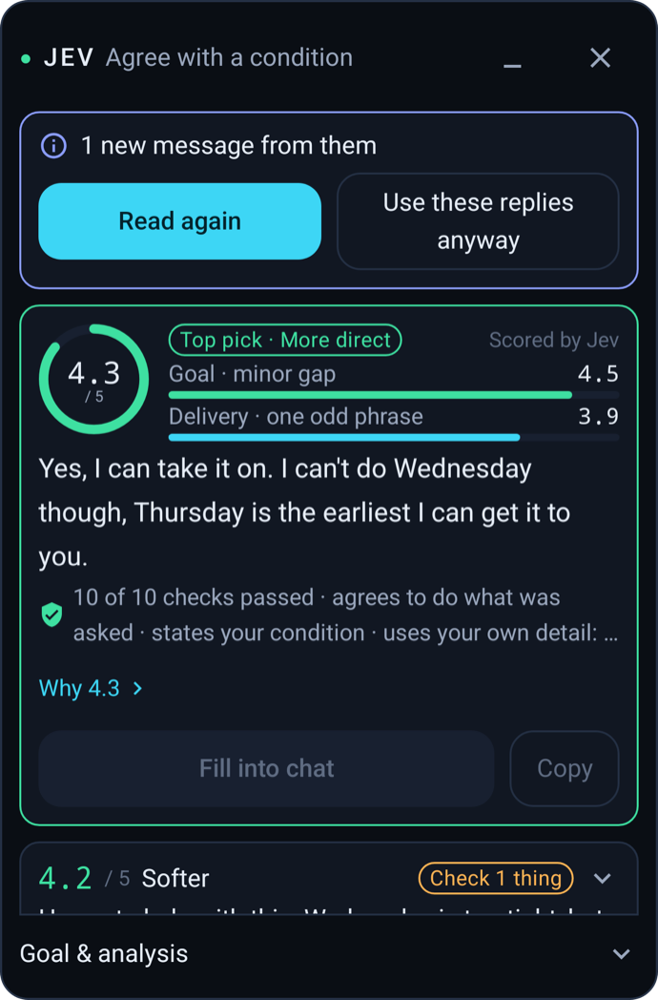
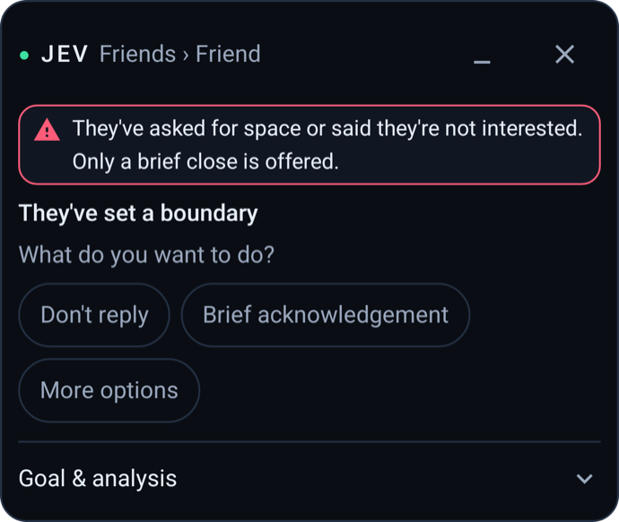
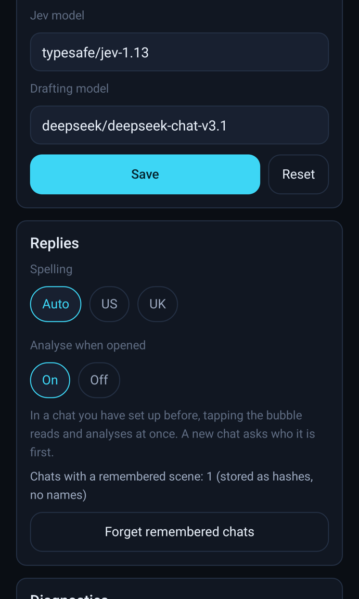
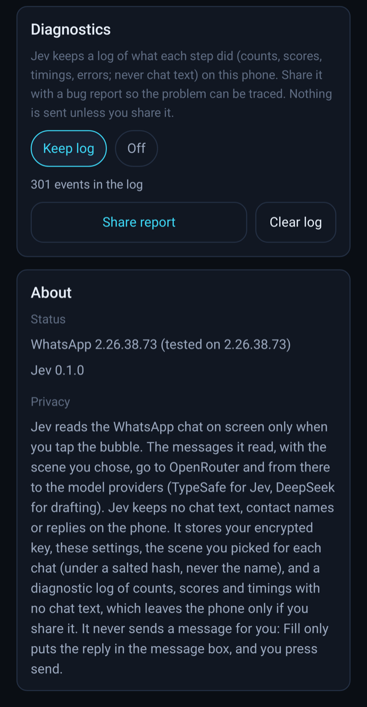

<div align="center">


# Jev for WhatsApp

**A reply copilot for WhatsApp on Android: it reads the chat on screen, works out what they want, drafts two replies, checks and scores them, and fills the one you pick into the message box. You press send.**

[](CHANGELOG.md)
[](#quick-start)
[](#whats-supported)
[](../LICENSE)

**English** · [中文](README.zh-CN.md) · [Privacy](PRIVACY.md) · [Changelog](CHANGELOG.md) · [Architecture](ARCHITECTURE.md)

</div>

## Get Jev for WhatsApp

| Android |
| :---: |
| [Download the APK (v0.1.0)](https://raw.githubusercontent.com/jev-chat/jev-chat-jarvis/main/overseas/apk/jev-whatsapp-v0.1.0-release.apk) |
| Android 11+ · any CPU · 10.6 MB · English chats |

This is the English, WhatsApp-only edition of Jev. It is a separate app from the
Chinese [Jev Chat Assistant](../README.en.md) (QQ, X, Feishu) in the repository root:
its own package (`com.jev.overseas`), its own engine and its own build. Both can be
installed on the same phone.

If the project helps you, a **Star** on the repository is welcome. It is not needed
to download or use the app.

## What it looks like

### The panel in WhatsApp

The real panel, rendered by the app with sample data (`PanelPreviewActivity` in the
debug build). Screenshots from a live chat will follow.

<table align="center">
<tr>
<td align="center" width="25%"><br/><sub><b>1. First time in a chat</b><br/>Who are you talking to?</sub></td>
<td align="center" width="25%"><br/><sub><b>2. Analysis</b><br/>What they want, then your options</sub></td>
<td align="center" width="25%"><br/><sub><b>3. Drafted, checking</b><br/>Two replies being scored</sub></td>
<td align="center" width="25%"><br/><sub><b>4. Results</b><br/>Score out of 5, Top pick, Fill</sub></td>
</tr>
<tr>
<td align="center"><br/><sub><b>5. Why 4.3</b><br/>Checks, goal and delivery</sub></td>
<td align="center"><br/><sub><b>6. Blocked</b><br/>A reply that promises too much</sub></td>
<td align="center"><br/><sub><b>7. Chat moved on</b><br/>A new message: read again</sub></td>
<td align="center"><br/><sub><b>8. A boundary</b><br/>Only a brief close is offered</sub></td>
</tr>
</table>

### The Jev app

Opened from the launcher. Setup and settings on one page (placeholder key shown).

<table align="center">
<tr>
<td align="center" width="33%"><br/><sub><b>Set up</b><br/>Key, accessibility service, first try; each step ticks when done</sub></td>
<td align="center" width="33%"><br/><sub><b>Models and replies</b><br/>Model ids, spelling, "Analyse when opened", remembered chats</sub></td>
<td align="center" width="33%"><br/><sub><b>Diagnostics and about</b><br/>Local log and bug report, versions, privacy</sub></td>
</tr>
</table>

```
Jev app
├── Header: JEV for WhatsApp, version
├── Set up
│   ├── 1  OpenRouter key: save, test connection, remove
│   ├── 2  Accessibility service: status, open settings
│   └── 3  Open a WhatsApp chat and tap the bubble
└── Settings
    ├── Models: Jev model, drafting model
    ├── Replies: spelling (Auto / US / UK), analyse when opened, forget remembered chats
    ├── Diagnostics: keep log, share report, clear log
    └── About: WhatsApp and Jev versions, privacy
```

## Why use it

- **It works out the situation before it writes.** The Jev model first answers a
  fixed set of questions about the latest messages: what they are asking for,
  pressure, boundaries, friction, tone. That places the exchange in a scene matrix
  and gives you options for how to respond. Only then does a drafting model write.
- **It writes to your goal, then checks.** The option you choose, plus any detail
  you type (a new date, an amount), becomes a goal with required items and things to
  avoid. Every draft is checked against it before you see a score.
- **Only a clean reply can be "Top pick".** A reply that promises something you did
  not ask for, decides more than you wanted, or leaves out your detail is blocked or
  marked "Check 1 thing", whatever its score.
- **It knows who you are talking to.** Five scenes (Work, Romance, Friends, Family,
  General) with relationship types. A reply to your manager and one to a close
  friend are judged differently, including whether to apologise.
- **Sending stays with you.** Jev writes into WhatsApp's message box and stops. It
  never presses send or enter.
- **It does not touch WhatsApp.** No root, no hooks, no modified APK, no WhatsApp
  account or API, no database. It reads the screen through Android's accessibility
  service, only when you tap the bubble.
- **Your key, your models, no server of ours.** Requests go to OpenRouter with your
  own key. There is no analytics and nothing is sent to the authors.

## What's supported

| Where | Status | Notes |
|---|---|---|
| WhatsApp for Android, one-to-one chats | ✅ v0.1 | Tested on 2.26.38.73, Android 16. Other versions may read wrongly until the adapter is updated |
| English | ✅ | A chat where the other person writes mostly in a non-Latin script is not analysed |
| Group chats | ❌ | Recognised and refused |
| WhatsApp Business, other apps | ❌ | Not supported |
| Photos, documents, stickers, video | ⚠️ partial | Not opened. A file sent on its own is answered from the messages around it |
| Voice notes, deleted messages | ❌ | Cannot be analysed as the latest message; you can write your own goal |

Jev only reads chats on your own device that you can see yourself.

## Quick start

**1. Install.** Download the signed release APK:
[jev-whatsapp-v0.1.0-release.apk](https://raw.githubusercontent.com/jev-chat/jev-chat-jarvis/main/overseas/apk/jev-whatsapp-v0.1.0-release.apk)
(Android 11+). Or with adb:

```bash
adb install -r overseas/apk/jev-whatsapp-v0.1.0-release.apk
```

**2. Add your key.** Open the Jev app, paste an [OpenRouter API key](https://openrouter.ai/keys)
and tap "Test connection". The defaults are `typesafe/jev-1.13` for the Jev model and
`deepseek/deepseek-chat-v3.1` for drafting; you can change both under Models.

**3. Turn on the accessibility service.** Tap "Open accessibility settings" and turn
on "Jev reply assistant". On Android 13 and later, an app installed from a file must
be allowed first: Settings › Apps › Jev › ⋮ › Allow restricted settings. No overlay
permission is needed.

**4. Try it.** Open a one-to-one WhatsApp chat in English and tap Jev's bubble.
The first time in a chat, Jev asks who you are talking to.

If you installed a debug build before, uninstall it first: the signatures differ.
Uninstalling clears the stored key and settings.

## Features

### Reading the chat

- Reads only after you tap the bubble, and only the WhatsApp chat on screen.
- Scrolls back to collect up to 24 recent messages, then returns to the bottom.
  "Read further back" reads about twice as far when they refer to something older.
- Knows who said what, quotes, edits, dates, files and voice notes; skips system
  notices. A group chat is recognised and refused.
- If the chat changes while Jev is reading or thinking, it notices and does not mix
  two chats.

### Scenes and analysis

- Five scenes, each with relationship types, for example Work › Manager or senior,
  Romance › Talking stage, Family › Parent or elder, plus "in a dispute" where it
  applies. Chosen once per chat and remembered under a salted hash, never the name.
- The analysis shows what they are asking for, where the exchange stands and the
  next step, with notices such as "They said 3 things" or a client complaint.
- Options to respond (stances) come from that, for example "On track", "It will be
  late", "Ask for more time", "Agree with a condition". "More options" shows the
  rest; "Write my own goal" lets you describe it yourself.

### Goal and drafting

- The stance becomes a goal: required items, things to avoid, commitments, and an
  apology level decided by scene, relationship and stance.
- Details you type (for example "Thursday") become required items of their own.
- Fine-tune switches for the round: "Don't apologise", "No new promises", "Don't
  explain why".
- The drafting model writes two replies in your spelling (US or UK, detected or set).

### Checks and score

- Hard checks block a reply: new commitments, committing other people, deciding
  more than the goal, taking the opposite stance, crossing a boundary, facts nobody
  gave.
- Confirm-only checks ask you to look first: admitting fault, contradicting a date,
  time or amount you gave earlier.
- The score out of 5 combines goal completion (G, six levels from "Opposite or
  absent" to "Complete") and delivery (E). A missing required item caps G.
- "Why 4.3" opens the breakdown: the conclusion, the checks (problems first), goal,
  delivery and how the score is calculated.

### Fill

- "Fill into chat" writes the chosen reply into WhatsApp's message box after checking
  that the same chat is still open. Text already in the box is replaced only after
  asking. "Copy" puts it on the clipboard instead.
- Jev never sends.

### Diagnostics

- A local log of each step with counts, scores and timings, never chat text.
- "Report a problem" (in Goal & analysis) or Jev app › Diagnostics › Share report
  creates a report you can paste into a GitHub issue. See [docs/DIAGNOSTICS.md](docs/DIAGNOSTICS.md).

## FAQ

<details>
<summary><b>Will it send messages for me?</b></summary>

No. Jev only writes the chosen reply into the message box. There is no code path
that presses the send button or the keyboard's enter key. You decide whether to send.

</details>

<details>
<summary><b>Do I need root? Can my WhatsApp account be banned?</b></summary>

No root and no modules. Jev does not modify WhatsApp, inject into it, use its API or
your account, or read its database. It reads what is on screen through Android's
accessibility service, the way a screen reader does. Whether any use of automation
is acceptable is decided by WhatsApp's terms; use Jev at your own judgement.

</details>

<details>
<summary><b>Are my chats uploaded?</b></summary>

When you tap the bubble, the messages Jev read (about 24) go to OpenRouter and from
there to the model providers, with the scene you chose, your goal and the drafted
replies. That includes the other person's messages. Nothing goes to the authors and
nothing is kept on the phone after the round. Details in [PRIVACY.md](PRIVACY.md).

</details>

<details>
<summary><b>How much does it cost?</b></summary>

The app is free and open source. Model calls are paid with your own OpenRouter key.
One round usually costs well under one US cent; a round is capped at 17 requests.
"Test connection" shows how much the key has used.

</details>

<details>
<summary><b>The bubble does not appear, or Jev cannot read the chat.</b></summary>

Check that the accessibility service "Jev reply assistant" is on. Some phones turn
accessibility services off after an app update or when the app is force-stopped;
turn it on again. The bubble shows only while WhatsApp is open. If WhatsApp was
updated, the reader may need an update too; please open an issue with the
diagnostic report.

</details>

<details>
<summary><b>Why does it ask me to choose or check things?</b></summary>

When Jev is unsure about something that changes the reply (for example whether they
asked for a deadline), it asks you instead of guessing. "Check 1 thing" on a reply
means one check was doubtful; read the reply, then tap "I've checked this" to use it.

</details>

## How it works

```
tap bubble → read the chat → who is this? (first time) → analyse (Jev)
  → pick a stance, add details → draft two replies → check and score (Jev) → Fill
  → you send
```

- **Reading**: an adapter turns WhatsApp's accessibility tree into messages (who,
  text, quotes, media kind) using WhatsApp's view ids; screens are stitched together
  while scrolling.
- **Analysis**: two parallel requests to the Jev model on OpenRouter's decisions
  endpoint. Jev only answers yes/no and multiple-choice questions with
  probabilities; thresholds turn them into detected, unsure or absent.
- **Drafting**: one chat-completion request for two replies, with the conversation
  given as data.
- **Checks**: Jev requests per reply for the checks, goal completion and delivery.
- **Fill**: sets the text of WhatsApp's input field; never sends.

Full description: [ARCHITECTURE.md](ARCHITECTURE.md).

<details>
<summary><b>Updating the reader for a new WhatsApp version</b></summary>

1. Install the `probe` app (`./gradlew :probe:assembleDebug`). It is read-only and has
   no network permission.
2. Record screens of a test chat between two test accounts as ScreenDumps
   (`jev.screendump/1`).
3. Compare with `fixtures/screendumps/whatsapp-2.26.38.73/` and update
   `core/.../whatsapp/WhatsAppAdapter.kt`.
4. Add the new dumps and golden files; `WhatsAppReplayTest` replays them on the JVM.

`python3 tools/probe/read_dump.py <dump.json>` prints the messages a dump yields.

</details>

<details>
<summary><b>Build and project layout</b></summary>

JDK 17 and the Android SDK (platform 35). Run from `overseas/`:

```bash
./gradlew test               # offline unit tests, no key and no network
./gradlew assembleDebug      # assistant/build/outputs/apk/debug/assistant-debug.apk
./gradlew assembleRelease    # needs a signing properties file outside the repo, named by JEV_OVERSEAS_KEYSTORE_PROPS
```

- `core/`: pure Kotlin, no Android types. Engine, scene matrices, session state
  machine, WhatsApp adapter, stitcher, model gateway, diagnostics. All unit tests.
- `a11y/`: accessibility node collection and row stability.
- `assistant/`: the app. Accessibility service, bubble, panel, reader, Fill,
  settings, encrypted key store.
- `probe/`: read-only screen recorder for adapter work.
- `fixtures/`: recorded screens and the authored test corpus.
- `tools/`: dump reader and a small OpenRouter client.
- `docs/`: [testing](docs/TESTING.md) and [diagnostics](docs/DIAGNOSTICS.md).
- `apk/`: the signed release APK.

Ground rules for contributions: never add a path that sends a message; keys never go
into the repo, logs or diagnostics; diagnostics never contain chat text; the
approved matrices in `core/src/test/resources/approved/` are the specification and
change only for an agreed behaviour change.

</details>

## Known limitations

- **One phone and one WhatsApp version tested.** Reading relies on WhatsApp's view
  ids, which can change in any update.
- **English and one-to-one only.** Groups are refused; a group screen showing only
  your own messages looks one-to-one until Jev reads an earlier screen.
- **Tuned on a small corpus.** The thresholds were tuned on an authored pilot set;
  the figures in [docs/TESTING.md](docs/TESTING.md) are agreement with the author's
  labels, not an independent validation.
- **Some checks are cautious.** A reply that only implies "it will be late" may show
  "Check 1 thing".
- **Same name, same chat.** Two contacts with the same display name share a
  remembered scene.
- **Edits to older messages.** Within 15 minutes Jev reuses what it read; an older
  message edited or deleted in that time is not seen.

## Feedback

Open an issue with the [WhatsApp bug report template](https://github.com/jev-chat/jev-chat-jarvis/issues/new?template=whatsapp-assistant-bug.md)
and paste the diagnostic report from the app. The report has no chat text. Tell us
which chats and situations you would most like Jev to handle.

## Sister projects

In the [jev-chat](https://github.com/jev-chat) organisation:

- [Jev Chat Assistant for Android](../README.en.md): QQ, X and Feishu, for chats in Chinese.
- [Jev for macOS](https://github.com/jev-chat/jev-chat-jarvis-mac) and
  [Jev for Windows](https://github.com/jev-chat/jev-chat-windows): desktop chat windows.

## License

Copyright © 2026 Finderchangchang and the jev-chat contributors. MIT, see
[LICENSE](../LICENSE) and [NOTICE](../NOTICE).

- Personal and commercial use, modification and redistribution are allowed.
- Keep LICENSE and NOTICE and credit the source when you distribute it.
- Do not use the Jev or jev-chat names to imply endorsement by the original authors.

**Privacy and disclaimer.** When you tap the bubble, chat text goes to the model
providers through OpenRouter with your own key; read [PRIVACY.md](PRIVACY.md) and
their policies. Jev is an independent project, not affiliated with, endorsed or
sponsored by WhatsApp LLC or Meta Platforms, Inc.; "WhatsApp" is a trademark of
WhatsApp LLC. Suggestions come from language models and can be wrong; you are
responsible for what you send. Use Jev only on your own device and chats, and follow
the terms and laws that apply to you.
